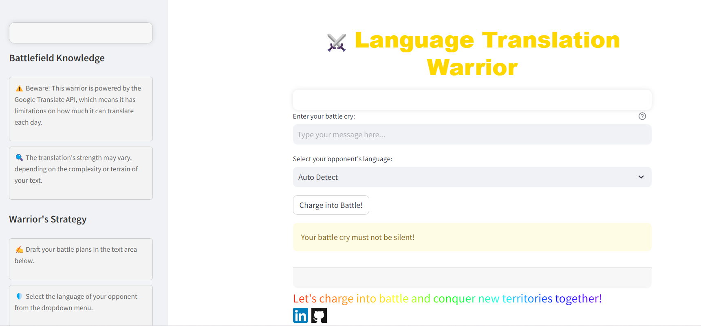

Sure! Here's an updated version of the README file including an image and a live link:

---

# Language Translation Warrior

Welcome to the Language Translation Warrior, your trusty companion in conquering language barriers!

## Overview

The Language Translation Warrior is a Streamlit app powered by the Google Translate API. It enables users to translate text into various languages, allowing them to communicate effectively across linguistic boundaries.

## Features

- **Intuitive UI**: User-friendly interface for seamless translation experience.
- **Automatic Language Detection**: Automatically detects the language of the input text.
- **Wide Language Support**: Supports translation into multiple languages.
- **Translation Limit Information**: Provides information about the daily translation quota.

## Usage

1. **Input Text**: Enter the text you want to translate in the designated text area.
2. **Select Target Language**: Choose the language into which you want to translate the text.
3. **Translate**: Click the "Charge into Battle!" button to initiate the translation.
4. **View Translation**: The translated text will be displayed below the input area.

## Limitations

- The Google Translate API has limitations on the number of characters that can be translated per day, currently set at approximately 1 million characters.

## Development

The app is developed using Streamlit, a Python framework for building interactive web applications. It utilizes the Googletrans library for translation.

## Live Demo

Try out the live demo [here](https://translator-lp.streamlit.app/).

## Developer

- **Lakshmi Prasanna**: [LinkedIn](https://www.linkedin.com/in/morla-lakshmi-prasanna-824072255) | [GitHub](https://github.com/LP-THE-CODER)

## Contributions

Contributions are welcome! If you have any suggestions, bug reports, or feature requests, please feel free to open an issue or submit a pull request.

## License

This project is licensed under the [MIT License](LICENSE).

---

Replace `https://example.com/translation_warrior.png` with the actual URL of your image and `https://example.com/language-translation-warrior` with the live link to your application.
